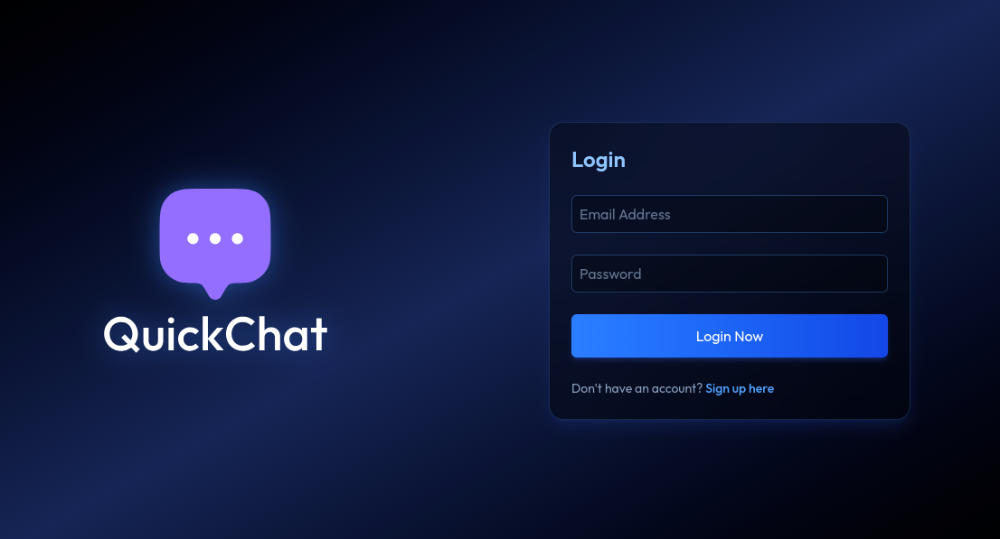
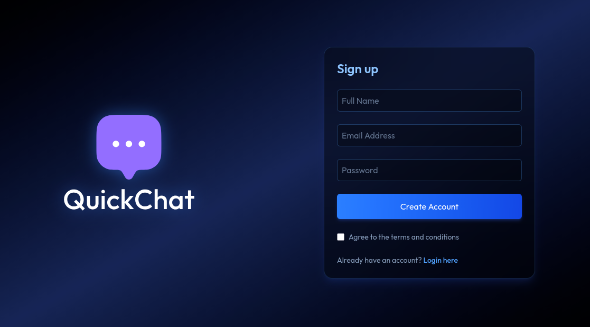
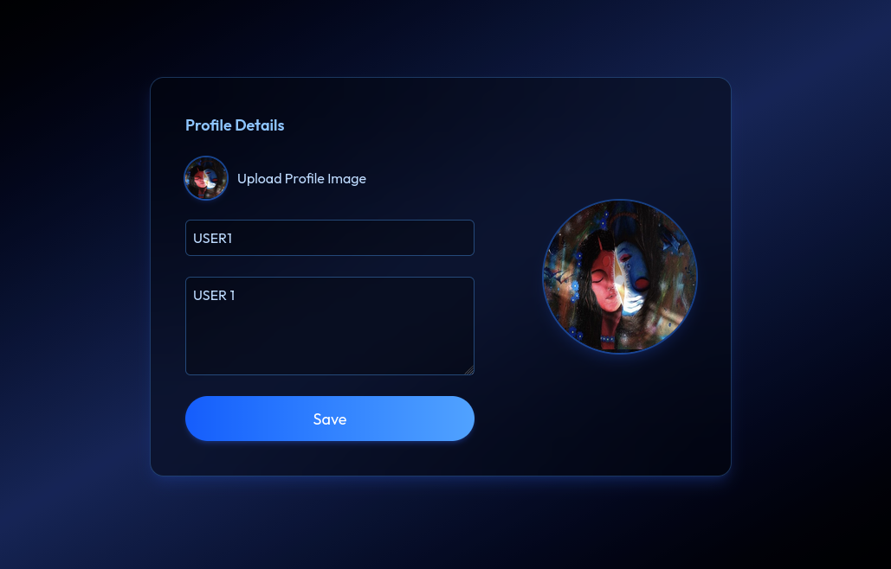
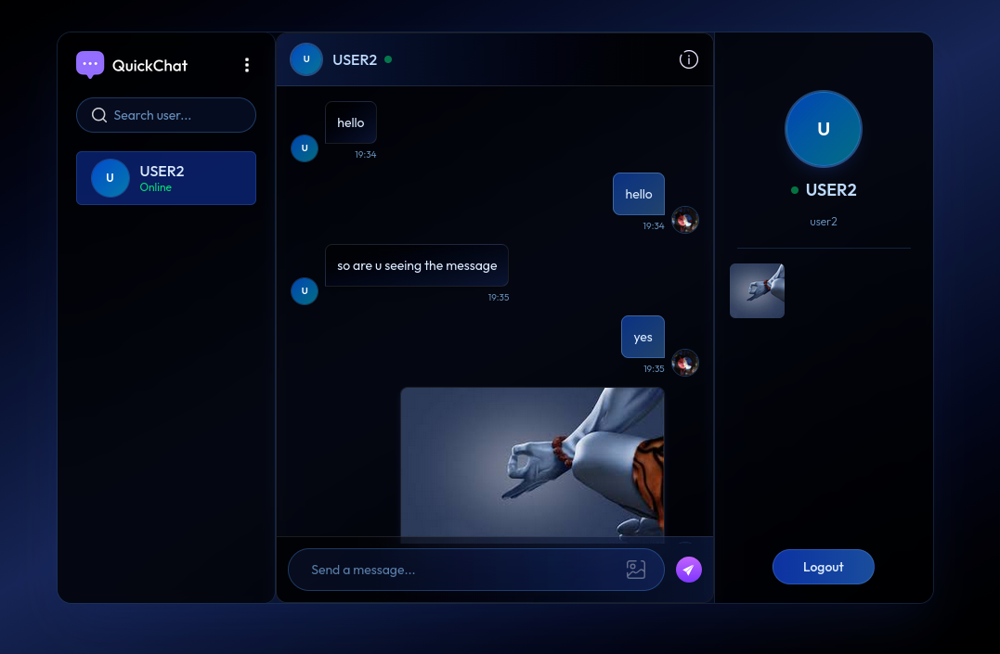
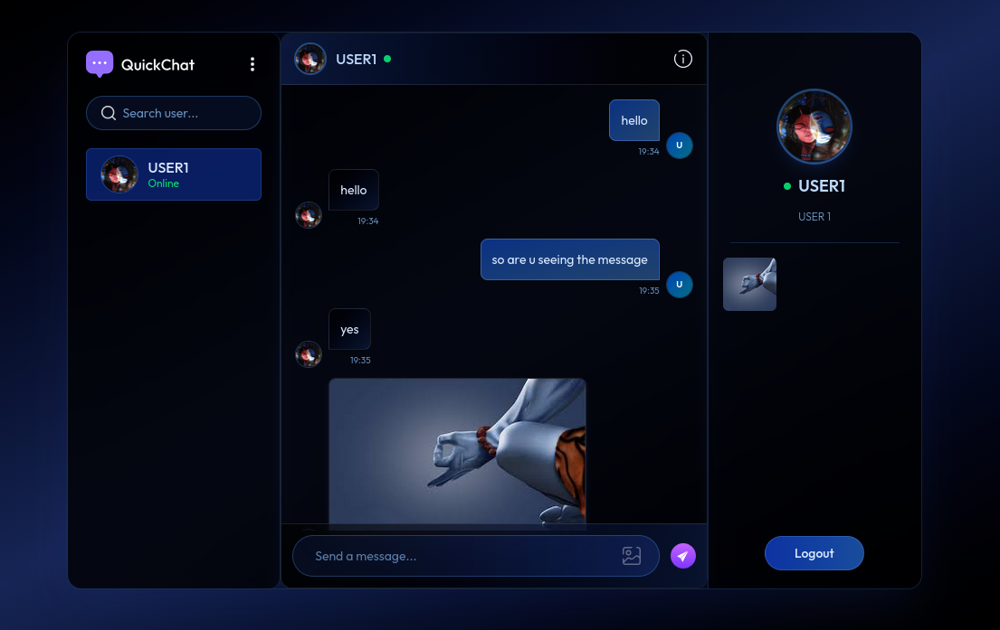
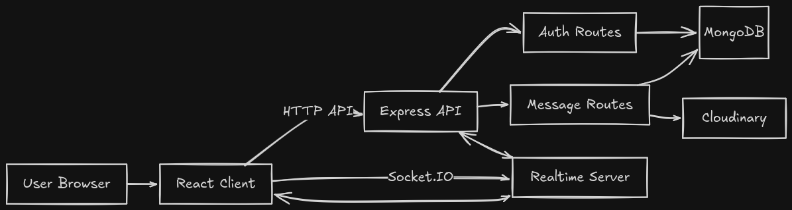

# QuickChat

QuickChat is a real-time chat application built with a React frontend and a Node.js backend. It lets users sign up, log in, update their profile, and send text or image messages instantly through Socket.IO.

## What it does

- User authentication with signup, login, and logout
- Profile editing with profile image upload
- Real-time messaging with online user status
- Image and text message support
- Seen status for messages

## Tech Stack

- Frontend: React, Vite, React Router, Axios, Socket.IO client
- Backend: Node.js, Express, Socket.IO, MongoDB, Mongoose
- Storage and media: Cloudinary

## Project Screenshots

### Login



### Sign Up



### Profile Details



### Chat Interface





## System Architecture



## How It Works

1. The user opens the React client in the browser.
2. The client sends API requests to the Express server for authentication and chat data.
3. Socket.IO handles real-time message delivery and online user updates.
4. MongoDB stores users and messages.
5. Cloudinary stores uploaded profile images and message images.

## Local Setup

### 1. Clone the project

```bash
git clone <your-repo-url>
cd quick-chat-app
```

### 2. Install dependencies

```bash
cd server && bun install
cd ../client && bun install
```

### 3. Configure environment variables

Create a `.env` file inside `server/` and `client/` if needed by your setup.

Typical backend variables:

```bash
MONGODB_URI=your_mongodb_connection_string
JWT_SECRET=your_jwt_secret
FRONTEND_URL=http://localhost:5173
PORT=5000
```

Typical frontend variable:

```bash
VITE_BACKEND_URL=http://localhost:5000
```

### 4. Run the app

In one terminal:

```bash
cd server
bun run dev
```

In another terminal:

```bash
cd client
bun run dev
```

## Summary

QuickChat is a simple, full-stack messaging app that demonstrates authentication, real-time communication, file uploads, and MongoDB-based persistence in a clean and practical way.
